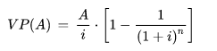
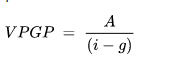

# Viabilidad ECONÓMICA

## Informes

???+ Abstract "Informe VIABILIDAD ECONÓMICA"
    !!! Warning "Editar informe ($t_{1^a\ carga}\leq 15s.$) "

    [{ loading=lazy }](https://eee1-uom5ariccq-ew.a.run.app/estudios/e_A_FINANCIACION){ .md-button }

## Valor tiempo del dinero

El **valor del dinero en el tiempo** (en inglés, *Time Value of Money*, abreviado usualmente como *TVM*) es un concepto [económico](https://es.wikipedia.org/wiki/Economía) basado en la premisa de que un [inversor](https://es.wikipedia.org/wiki/Inversión) prefiere recibir un pago de una suma fija de [dinero](https://es.wikipedia.org/wiki/Dinero) hoy, en lugar de recibir el mismo [valor nominal](https://es.wikipedia.org/wiki/Valor_nominal) en una determinada fecha futura. Esta preferencia se debe a que, si el  inversor recibe el dinero hoy, podría re invertir el dinero para obtener un monto mayor en la fecha , debido al [interés](https://es.wikipedia.org/wiki/Interés) que genera dicha inversión.

Muchos autores relacionan erróneamente el "valor del dinero en el tiempo" con la inflación. Dado que como se explica anteriormente, el  inversor podría encontrarse en un contexto sin inflación y realizar una  inversión para obtener un interés. Y si bien la inflación probablemente  influya en el valor del interés que genere la inversión (siendo mayor  cuanto más grande sea la inflación) aún con inflación nula las  inversiones se realizan con una determinada tasa de interés.

### Cálculos

Todas las fórmulas relacionadas con este concepto están basadas en la misma fórmula básica, el [valor presente](https://es.wikipedia.org/wiki/Valor_presente) de una suma futura de dinero, [descontada](https://es.wikipedia.org/wiki/Descuento) al presente. Por ejemplo, una suma *FV* a ser recibida dentro de un año debe ser descontada (a una tasa apropiada *r*) para obtener el valor presente, *PV*.


 Algunos de los cálculos comunes basados en el valor tiempo del dinero son:

- **Valor presente** (PV) de una suma de dinero que será recibida en el futuro.
- **Valor presente de una [anualidad](https://es.wikipedia.org/wiki/Anualidad)** (PVA) es el valor presente de un flujo de pagos futuros iguales, como los pagos que se hacen sobre una [hipoteca](https://es.wikipedia.org/wiki/Hipoteca).
- **Valor presente de una perpetuidad** es el valor de un flujo de pagos perpetuos, o que se estima no serán interrumpidos ni modificados nunca.
- **Valor futuro** (FV) de un monto invertido (por ejemplo, en una cuenta de depósito) a una cierta tasa de interés.
- **Valor futuro de una anualidad** (FVA) es el valor futuro de un  flujo de pagos (anualidades), donde se asume que los pagos se  reinvierten a una determinada tasa de interés.

Hay una serie básica de ecuaciones que representan las operaciones  listadas anteriormente. Las soluciones pueden ser calculadas (en la  mayoría de los casos) usando las fórmulas, una calculadora financiera o  una [hoja de cálculo](https://es.wikipedia.org/wiki/Hoja_de_cálculo). Las fórmulas están programadas en casi todas las calculadoras  financieras, y algunos programas de hoja de cálculo también las tienen a disposición del usuario (por ejemplo, PV, FV, RATE, NPER y PMT).[1](https://es.wikipedia.org/wiki/Valor_tiempo_del_dinero#cite_note-1)

Para cualquiera de los ecuaciones, las fórmulas pueden ser  utilizadas para determinar cualquier de las variables desconocidas. Para el caso de las tasas de interés, sin embargo, no existe un  procedimiento matemático para resolverlas, por lo que la única forma de  hacerlo es por medio de prueba y error (para estos casos, una  calculadora financiera o una hoja de cálculo es sumamente útil, pues las pruebas tardan fracciones de segundo).

Las ecuaciones son frecuentemente combinadas para usos particulares. Por ejemplo, el precio de los [bonos](https://es.wikipedia.org/wiki/Bono_(finanzas)) puede ser calculado usando estas ecuaciones.

Para los cálculos sobre anualidades, se debe tener claro si los pagos se hacen al inicio o al final del periodo.

### Fórmulas

#### Valor presente de una suma futura

El valor presente del dinero es el monto que una persona estaría dispuesta a pagar hoy a cambio de una cantidad que recibirá en el futuro y está  dado por


Esta fórmula es fundamental para determinar el valor tiempo del dinero; todas las demás fórmulas se obtienen a partir de esta.

El valor presente acumulado de flujos de efectivo futuros puede ser calculado sumando las contribuciones de                     F                  V                      t                                {\displaystyle FV_{t}}   , el valor del flujo de efectivo en el tiempo                     t           


Nótese que esta serie puede ser sumada para un valor         $n -> \propto^2$     

#### Valor presente de una anualidad para n periodos de pago

En este caso los valores de flujo de efectivo se mantienen constantes a  través de n periodos. El valor presente de una anualidad (VPA) tiene  cuatro variables:

1. VPA, el valor del dinero en tiempo t = 0.
2. A, el valor de los pagos individuales en cada periodo.
3. i, la tasa de descuento para cada periodo.
4. n es el número de periodos de pago.



Para obtener el VP de una anualidad anticipada, multiplicar la ecuación anterior por (1 + i).

#### Valor presente de una anualidad creciente

En este caso, cada uno de los flujos de efectivo crecen por un factor de  (1+g). Similar a la fórmula de una anualidad, el valor presente de una  anualidad creciente usa las mismas variables en adición a *g*, que es la tasa de crecimiento de la anualidad (A es el pago de la anualidad en el primer periodo).


#### Valor presente de una perpetuidad

Cuando            $n -> \propto^2$ el PV de una perpetuidad (una anualidad perpetua) es una simple división:


#### Valor presente de una perpetuidad creciente

Cuando la perpetuidad anual crece a una tasa fija (g), se debe utilizar esta  fórmula. En la realidad, hay pocos instrumentos financieros que cumplan  con esta característica. Sin embargo, suponga que un analista intenta  calcular el valor de la acción de una empresa que paga dividendos. El  analista podrá estimar el pago de dividendos para los próximos periodos, pero llegará a un punto en que no podrá seguir estimando hacia el  futuro. A partir de este punto, el analista debe estimar cuánto puede  crecer el pago de dividendos en la perpetuidad. Por ejemplo, la empresa  aumentará los dividendos en un 3 % durante los próximos tres años, y de  ahí en adelante, los dividendos aumentarán un 1 % cada año. El valor de  esta perpetuidad se calcula de la siguiente forma:



#### Valor futuro de una anualidad

- VF(A), el valor de la anualidad A en el tiempo = n (futuro).
- A, el valor de los pagos individuales en cada periodo de pago.
- i, la tasa de interés.
- n, el número de periodos de pago.


#### Valor futuro de una anualidad creciente

Consiste en la idea de invertir en el momento actual, para obtener un rendimiento en el futuro.

- VF(A), el valor de la anualidad A en el tiempo                     n              {\displaystyle n}   .
- A, el valor de los pagos individuales en cada periodo de pago.
- i, la tasa de interés.
- g, la tasa de crecimiento en cada periodo.
- n, el número de periodos de pago.


## Flujo de caja

[Ir a la navegación](https://es.wikipedia.org/wiki/Flujo_de_caja#mw-head)[Ir a la búsqueda](https://es.wikipedia.org/wiki/Flujo_de_caja#searchInput)

En [finanzas](https://es.wikipedia.org/wiki/Finanzas), se entiende por **flujo de caja** (en [inglés](https://es.wikipedia.org/wiki/Idioma_inglés), *cash flow*) o **flujo de finanzas** el conjunto de los flujos de entradas y salidas de caja o efectivo en un periodo dado.

El flujo de caja es la acumulación neta de activos líquidos en un periodo determinado y, por lo tanto, constituye un indicador importante de la liquidez de una empresa.

El estudio de los flujos de caja dentro de una empresa puede ser utilizado para determinar:

- Problemas de liquidez. El ser rentable no significa  necesariamente poseer liquidez. Una compañía puede tener problemas de  efectivo, aun siendo rentable. Por lo tanto, permite anticipar los  saldos en dinero.
- Para analizar la viabilidad de proyectos de inversión, los flujos de fondos son la base de cálculo del [valor actual neto](https://es.wikipedia.org/wiki/Valor_actual_neto) y de la [tasa interna de retorno](https://es.wikipedia.org/wiki/Tasa_interna_de_retorno).
- Para medir la rentabilidad o crecimiento de un negocio cuando se entienda que las [normas contables](https://es.wikipedia.org/wiki/Normas_contables) no representan adecuadamente la realidad económica.

Los flujos de liquidez se pueden clasificar en tres partes:

1. Flujos de caja operacionales: efectivo recibido o expendido como resultado de las actividades económicas de base de la compañía.
2. Flujos de caja de inversión: efectivo recibido o expendido  considerando los gastos en inversión de capital que beneficiarán el  negocio a futuro. (Ej: la compra de maquinaria nueva, inversiones o  adquisiciones.)
3. Flujos de caja de financiamiento: efectivo recibido o expendido como resultado de actividades financieras, tales como recepción o pago de  préstamos, emisiones o recompra de acciones y/o pago de dividendos.

- https://es.wikipedia.org/wiki/Flujo_de_caja#Bibliografía)

### Elaborar un flujo de caja

Usualmente el flujo de caja se calcula con una matriz con columnas y filas. En las columnas se disponen los períodos, por lo general, meses; y en las  filas los ingresos y las salidas de dinero.

- Entradas: es todo el dinero que ingresa la empresa por su  actividad productiva o de servicios, o producto de la venta de activos  (desinversión), subvenciones, etc.
- Salidas: es todo dinero que sale de la empresa y que es necesario  para llevar a cabo su actividad productiva. Incluye los costos variables y fijos.

Para su elaboración es útil usar una [plantilla de cálculo](https://es.wikipedia.org/w/index.php?title=Plantilla_de_cálculo&action=edit&redlink=1). La fórmula que se puede usar para sacar el flujo de caja proyectado es:

```
+Ingresos afectos a Impuestos
- Gastos no desembolsados
= Utilidad Antes de Impuestos (BAI)
- Impuestos
= Utilidad después de Impuestos (BDI)
+ Ajustes por gastos no desembolsados (Amortizaciones y provisiones)
- Egresos no afectos a Impuestos
+ Beneficios no afectos a Impuestos
= Flujo de Caja.
```

#### Cálculo del flujo de caja personal

Teóricamente, calcular el flujo de caja de una persona no debería ser difícil,  siempre que se disponga de las cifras exactas de ingresos y de gastos.  En la práctica, resulta un proceso más complejo porque se generan más  beneficios y gastos de los que quedan impresos en facturas y cuentas  corrientes; por ejemplo, el interés que nos da nuestro dinero, nuestras  inversiones, los gastos de dichas inversiones, etc. Por eso llevar una  cartera de ingresos y gastos diaria y actualizada dará al final de mes  las cifras que se buscan. Calcular el flujo de caja y obtener el gráfico de movimientos durante periodos de tiempo largos nos dará una visión  global de dónde se genera nuestro dinero y a qué se destina a largo  plazo, cuándo son las épocas en que se generan más gastos y cuándo más  beneficios. La fórmula básica del cálculo sería:

**Flujo de caja** = Beneficios netos + Amortizaciones + Provisiones

#### Mejora del flujo de caja

Cuando hablamos de mejorar el flujo de caja nos referimos a mejorar el  resultado final del cálculo. En nuestro caso lo haremos a escala  doméstica pues a escala empresarial son muchos los factores que entran  en juego. La forma principal de hacerlo es reduciendo los costos, aunque en el caso empresarial también ha de tenerse en cuenta la mejora del  rendimiento de las inversiones por ejemplo, un aspecto muy importante  entre los muchos que hay.

1. Lo primero y más importante de todo sería no perder de vista  ningún movimiento tanto a la alza como a la baja de nuestra caja, para  poder así llevar un cálculo exacto.
2. Intentar reducir o refinanciar el interés con el banco en el caso de que se estuviera con un crédito o una hipoteca y observar los bancos de la competencia lo que cobran por los servicios que nosotros utilizamos  más a menudo. Por ejemplo las fusiones bancarias habitualmente traen  consigo revisiones de costos que no van a nuestro favor o no son tan  favorables como con la anterior entidad.
3. Reducir nuestro gasto con la tarjeta de crédito, reduciendo así los  astronómicos valores de las comisiones que pagamos por usarla.
4. Hacer tus transferencias tu mismo desde el cajero o automatizarlas en el caso de que hagas transferencias habitualmente.
5. Reducir esos costos que tienes y podrías evitarte llevando el  desayuno de casa en vez de ir a la cafetería, intentar aprovechar los  descuentos o épocas de rebajas para hacer tus compras o gastos, usar la  tarifa telefónica que se adapte mejor a tu horario.... en definitiva  pequeñas cosas que suman al final del ejercicio.

#### NOPCAF

El **NOPCAF**, acrónimo del inglés, *Net Operating Cash Flow*, y traducido al español como «Flujo de Efectivo Neto de Trabajo»,  representa el total de los flujos de efectivo de una empresa en un  periodo dado, que por lo general es anual. Este indicador es utilizado principalmente en la valuación de empresas, y es una de las variables para determinar el EVA (Economic Value Added,  por sus siglas en inglés), o [Valor Económico Agregado](https://es.wikipedia.org/w/index.php?title=Valor_Económico_Agregado&action=edit&redlink=1), así como el VPN ([Valor Presente Neto](https://es.wikipedia.org/wiki/Valor_actual_neto)).

La fórmula utilizada para determinar el NOPCAF es:

**NOPCAF=GO+CNT**

dónde: NOPCAF=Flujo de Efectivo Neto de Trabajo; GO=Generación Operativa ([Utilidad Neta Después de Impuestos](https://es.wikipedia.org/w/index.php?title=Utilidad_Neta_Después_de_Impuestos&action=edit&redlink=1) + [Depreciación](https://es.wikipedia.org/w/index.php?title=Depreciación_económica&action=edit&redlink=1)); CNT=Capital Neto de Trabajo

#### Flujo de financiación

El flujo de financiación es el conjunto de [contratos de crédito](https://es.wikipedia.org/wiki/Contrato_de_crédito) bajo la forma de [apertura de crédito](https://es.wikipedia.org/wiki/Apertura_de_crédito), [descuento comercial](https://es.wikipedia.org/wiki/Descuento_comercial), [anticipo](https://es.wiktionary.org/wiki/anticipo), [pago aplazado](https://es.wikipedia.org/wiki/Pago_aplazado), [cesión de créditos](https://es.wikipedia.org/wiki/Cesión_de_crédito) o cualesquiera otros que cumplan con una función equivalente de financiación otorgados a una empresa por una misma [entidad de crédito](https://es.wikipedia.org/wiki/Entidad_de_crédito).[1](https://es.wikipedia.org/wiki/Flujo_de_caja#cite_note-1)


## Valor actual neto


El **valor actual neto**, también conocido como  valor actualizado neto o valor presente neto (en inglés *net present value*), cuyo acrónimo es VAN (en inglés, NPV), corresponde al [valor presente](https://es.wikipedia.org/wiki/Valor_tiempo_del_dinero) de los flujos de caja netos (ingresos - egresos) originados por una inversión. 

La fórmula para calcular el Valor Actual Neto es:


El valor de *k* que hace que el VAN tome un valor igual a 0, se denomina [tasa interna de retorno](https://es.wikipedia.org/wiki/Tasa_interna_de_retorno) (TIR) y es una medida de la rentabilidad de una inversión. 


### Interpretación

| Valor   | Significado                                                  | Decisión a tomar                                             |
| ------- | ------------------------------------------------------------ | ------------------------------------------------------------ |
| VAN > 0 | La inversión produciría ganancias por encima de la rentabilidad exigida (r) | El proyecto puede aceptarse                                  |
| VAN < 0 | La inversión produciría pérdidas por debajo de la rentabilidad exigida (r) | El proyecto debería rechazarse                               |
| VAN = 0 | La inversión no produciría ni ganancias ni pérdidas          | Dado que el proyecto no agrega valor monetario por encima de la  rentabilidad exigida (r), la decisión debería basarse en otros  criterios, como la obtención de un mejor posicionamiento en el mercado u otros factores |

El **valor actual neto** es muy importante para la valoración de  inversiones en activos fijos, a pesar de sus limitaciones en considerar  circunstancias imprevistas o excepcionales de mercado. Si su valor es  mayor a cero, el proyecto es rentable, considerándose el valor mínimo de rendimiento para la inversión. Al respecto, Johnson (1998) se expresa  así: “En resumen, un proyecto de inversión de capital debería aceptarse  si tiene un valor presente neto positivo, cuando los flujos de efectivo  esperados se descuentan al costo de oportunidad”. (p. 45)

Una empresa suele comparar diferentes alternativas para comprobar si un  proyecto le conviene o no. Normalmente la alternativa con el VAN más  alto suele ser la mejor para la entidad; pero no siempre tiene que ser  así. Hay ocasiones en las que una empresa elige un proyecto con un VAN  más bajo debido a diversas razones como podrían ser la imagen que le  aportará a la empresa, por motivos estratégicos u otros motivos que en  ese momento interesen a dicha entidad.

Puede considerarse también la interpretación del VAN, en función de la creación de valor para la empresa:

\- Si el VAN de un proyecto es positivo, el proyecto crea valor.

\- Si el VAN de un proyecto es negativo, el proyecto destruye valor.

\- Si el VAN de un proyecto es cero, el proyecto no crea ni destruye valor.


## Tasa interna de retorno


La *tasa interna de retorno*, *tasa interna  de rentabilidad* (TIR) o *tasa de rentabilidad interna* (TRI) de una inversión es la [media geométrica](https://es.wikipedia.org/wiki/Media_geométrica) de los rendimientos futuros esperados de dicha inversión, y que implica por cierto el supuesto de una oportunidad para "reinvertir". En  términos simples, diversos autores la conceptualizan como la [tasa de descuento](https://es.wikipedia.org/wiki/Tasa_de_descuento) con la que el [valor actual neto](https://es.wikipedia.org/wiki/Valor_actual_neto) o [valor presente neto](https://es.wikipedia.org/wiki/Valor_presente_neto) (VAN o VPN) es igual a cero.[1](https://es.wikipedia.org/wiki/Tasa_interna_de_retorno#cite_note-1)[2](https://es.wikipedia.org/wiki/Tasa_interna_de_retorno#cite_note-2)

La TIR puede utilizarse como indicador de la rentabilidad de un proyecto: a mayor TIR, mayor rentabilidad;[3](https://es.wikipedia.org/wiki/Tasa_interna_de_retorno#cite_note-3)[4](https://es.wikipedia.org/wiki/Tasa_interna_de_retorno#cite_note-4) así, se utiliza como uno de los criterios para decidir sobre la aceptación o rechazo de un proyecto de inversión.[5](https://es.wikipedia.org/wiki/Tasa_interna_de_retorno#cite_note-5) Para ello, la TIR se compara con una tasa mínima o tasa de corte, el  coste de oportunidad de la inversión (si la inversión no tiene riesgo,  el [coste de oportunidad](https://es.wikipedia.org/wiki/Coste_de_oportunidad) utilizado para comparar la TIR será la tasa de rentabilidad libre de  riesgo). Si la tasa de rendimiento del proyecto - expresada por la TIR-  supera la tasa de corte, se acepta la inversión; en caso contrario, se  rechaza. 


### Otras Definiciones

- Es la tasa que iguala la suma del valor actual de los gastos con la suma del valor actual de los ingresos previstos:                   

  

- Es la tasa de interés para la cual los ingresos totales actualizados es igual a los costos totales actualizados:                             

- Es la tasa de interés por medio de la cual se recupera la [inversión](https://es.wikipedia.org/wiki/Inversión).

- Es la tasa de interés máxima a la que se pueden endeudar para no perder dinero con la inversión.

- Es la tasa real que proporciona un proyecto de inversión y es  aquella que al ser utilizada como tasa de descuento en el cálculo de un  VAN dará como resultado 0.

- Es la tasa de interés compuesto al que permanecen invertidas las cantidades no retiradas del proyecto de inversión.[6](https://es.wikipedia.org/wiki/Tasa_interna_de_retorno#cite_note-Mascareñas_1-6)

### Cálculo de la Tasa Interna de Retorno

El tipo de descuento que hace igual a cero el valor actualizado neto ([VAN](https://es.wikipedia.org/wiki/VAN)):


Sin embargo, el cálculo obtenido puede estar bastante alejado de la TIR real.

Una aproximación más sencilla y útil es el VAN por unidad  invertida y año, sumado al tipo de descuento (usado para calcular dicho  VAN). Esta media tiene la ventaja de poderse ajustar mediante  iteraciones y se usa en aquellos casos en que ya conocemos el valor del  VAN[7](https://es.wikipedia.org/wiki/Tasa_interna_de_retorno#cite_note-Galindo-7)

### Uso general de la TIR

Y como ya se ha comentado anteriormente, la **TIR** o tasa de rendimiento interno, es una herramienta de toma de decisiones de [inversión](https://es.wikipedia.org/wiki/Inversión) utilizada para conocer la factibilidad de diferentes opciones de inversión. 

El criterio general para saber si es conveniente realizar un proyecto es el siguiente: 

- Si **TIR                     ≥               r**                     Se aceptará el proyecto. La razón es que el proyecto da una  rentabilidad mayor que la rentabilidad mínima requerida (el coste de  oportunidad), lo que significa que si invirtieramos en un proyecto en  específico (TIR) ganaríamos más dinero que por ejemplo adquieriendo  bonos del estado (r).
- Si **TIR                     <                      r**    Se rechazará el proyecto. La razón es que el proyecto da una  rentabilidad menor que la rentabilidad mínima requerida. Lo que indica  que si inviertieramos por ejemplo en bonos del estado (r), ganaríamos  más dinero que si lo hiciesemos en un proyecto en específico (TIR).

r representa el costo de oportunidad o en otras palabras la [tasa de interés](https://es.wikipedia.org/wiki/Valor_tiempo_del_dinero).

### Dificultades en el uso de la TIR

- **Criterio de aceptación o rechazo**. El criterio general sólo es cierto si el proyecto es del tipo *"prestar o invertir"*, es decir, si es probable que los primeros flujos de caja sean negativos y los siguientes positivos.

- Por el contrario, si el proyecto es del tipo 

  "pedir prestado o pedir prestado para invertir"

   (con probabilidad de flujos de caja positivos al principio y negativos  después), y teniendo en cuenta que la tasa interna de retorno esperada  es mayor, la decisión de aceptar o rechazar un proyecto se toma de  manera contraria:

  - Si **TIR > r**          Se rechazará el proyecto. La rentabilidad que nos está requiriendo este préstamo es mayor que nuestro costo de oportunidad. De esta manera, las ganancias que espera nuestro prestamista (TIR) son mayores que las que  ganancias que esperaríamos si por ejemplo inviertiesemos ese préstamo  recibido en bonos del estado (r).
  - Si **TIR <= r**      Se aceptará el proyecto. De esta manera, las ganancías que obtendríamos luego de invertir el prestamo recibido (r), por ejemplo en bonos del  estado; alcanzarían a librar las ganancias que espera nuestro  prestamista (TIR).

- **Comparación de proyectos excluyentes**. Dos proyectos son  excluyentes si solamente se puede llevar a cabo uno de ellos.  Generalmente, la opción de inversión con la TIR más alta es la  preferida, siempre que los proyectos tengan el mismo riesgo, la misma  duración y la misma inversión inicial. Si no, será necesario aplicar el  criterio de la TIR de los flujos incrementales.

- **Proyectos especiales**, también llamado el problema de la *inconsistencia de la TIR*. Son proyectos especiales aquellos que en su serie de flujos de caja hay más de un cambio de signo. Estos pueden tener más de una TIR, tantas  como cambios de signo, lo cual obedece a la presencia de la regla de los signos de Descartes. Esto complica el uso del criterio de la TIR para  saber si aceptar o rechazar la inversión. Para solucionar este problema, se suele utilizar la TIR Corregida. También la inconsistencia de la TIR tiene lugar cuando existen proyectos que no tienen TIR.[6](https://es.wikipedia.org/wiki/Tasa_interna_de_retorno#cite_note-Mascareñas_1-6)

### Ejemplo

Supongamos una inversión que nos da estos flujos de caja:

|               | Año 1 | Año 2 | Año 3 | Año 4 |
| ------------- | ----- | ----- | ----- | ----- |
| Flujo de caja | 31    | -72   | 91    | 22    |

Ahora tenemos flujos de caja negativos. Al resolver la TIR para este  caso con métodos recursivos podemos dar hasta con 2 TIR diferentes,  correspondientes a **los cambios de signo** de los flujos de caja (no al número de flujos de caja negativos).

Para calcular la TIR, llamada en estos casos TIRC (TIR Corregida) hay que hacer un análisis año por año del saldo del proyecto/inversión. Con una ROI = 20% y un K = 12% (Coste de financiación) y una duración  del proyecto de 5 años obtendríamos un saldo acumulado de 82,3. El  cálculo de la TIRC es sencillo:


Para el ejemplo anterior, con D = -200 hubiéramos obtenido una  TIRC de -19%, con lo que estaríamos perdiendo dinero con total  seguridad. Es claro, ya que invertimos 200 para recibir un total  acumulado de 82,3.

### Interpretación

En términos simples, la Tasa Interna de Retorno (TIR) es el porcentaje de  ingresos que se obtiene periódicamente debido a una inversión. Por  ejemplo, si del análisis de un proyecto en dólares se obtiene una TIR de 10% anual, significa que por cada 100 dólares invertidos se obtiene un  ingreso de 10 dólares cada año. 

Este es un término un poco ambiguo de interpretar. En resumen,  este parámetro ayuda a tomar la decisión de si una inversión es rentable o no, vamos a verlo:

Tenemos un proyecto A. Este proyecto, nos garantiza unos Flujos de Caja en *t* años. Para visualizar la idea, escogemos *t = 1*, es decir un solo año. De acuerdo a lo descrito previamente: 


Es decir, hemos transcrito los Flujos de Caja generados  anteriormente a la inversión inicial más una cierta ganancia (en  porcentaje).  

Ahora bien, en el mercado encontramos productos que nos pueden dar una rentabilidad *r*, conocida como [Required Rate of Return](https://www.investopedia.com/terms/r/requiredrateofreturn.asp)), como puede ser un bono que nos de por ejemplo un 10%. Esto no es más que un [coste de oportunidad](https://es.wikipedia.org/wiki/Coste_de_oportunidad), es decir, pese a que los cálculos para calcular esta *r* puedan ser complicados la podemos pensar como la inversión más fácil  que podríamos encontrar en el mercado o bien como la inversión que  estamos descartando por haber escogido otra. 

Entonces **sabidos y fijados los Flujos de Caja y la TIR**, descontaríamos los Flujos de Caja con esta *r* , **como si hubiéramos re-invertido los Flujos de Caja en el producto que ofrece la rentabilidad \*r\*** y ahora la quisiéramos descontar para saber el Valor Presente Neto de la inversión. De nuevo, con *t = 1*, de manera ilustrativa: 


Por ejemplo;  

Una *r = 0* quiere decir que no hemos encontrado en el  mercado ninguna inversión que nos de rentabilidad. Entonces no  descontaríamos nada. Como la TIR suele ser mayor que 0, la decisión  sería la de invertir.  

Una *r > TIR* quiere decir que en el mercado **hemos encontrado una inversión que nos da un retorno mayor** que el equivalente de los Flujos de Caja a porcentaje de retorno, ergo  la decisión sería la de no invertir en el producto con estos Flujos de  Caja y sí en el producto que ofrece la rentabilidad *r*, si se quiere.  

Una *r < TIR* quiere decir que en el mercado **hemos encontrado una inversión que nos da un retorno menor** que el equivalente de los Flujos de Caja a porcentaje de retorno, ergo  la decisión sería la de invertir en el producto con estos Flujos de Caja y no en el producto que ofrece la rentabilidad *r*, si se quiere.


## Referencias

- [Valor actual neto](https://es.wikipedia.org/wiki/Valor_actual_neto)
- [Flujo de caja](https://es.wikipedia.org/wiki/Flujo_de_caja)
- [Tasa interna de retorno](https://es.wikipedia.org/wiki/Tasa_interna_de_retorno)
- [Valor tiempo del dinero](https://es.wikipedia.org/wiki/Valor_tiempo_del_dinero)

