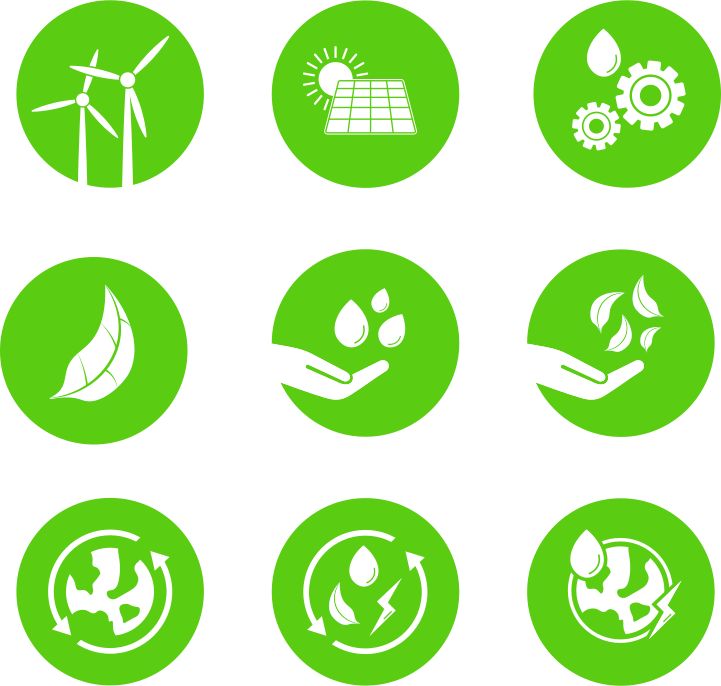

# Asolear

=== ":material-solar-power: Renovables "
    === ":fontawesome-solid-solar-panel: Fotovoltaica "
        
        
    === ":material-wind-turbine: Eolica "
        !!! info  "[{ width="40" } EOLICA](./RENOVABLES/Instalacion_EOLICA.md){ .md-button }"

=== ":material-file-document-edit:Asesoria"

    !!! info "[Compensación de excedentes](./AUDITORIA/Anexo_IV_Ejemplos.md){ .md-button }"
    !!! info  "[La Factura de la luz](./AUDITORIA/Factura_Luz.md){ .md-button }"
    !!! info  "[Viabilidad Economica](./AUDITORIA/Viabilidad_Economica.md){ .md-button }"

=== ":fontawesome-solid-euro-sign:Ayudas "

    !!! info  "[Estudio gratuito](./Estudio_Tecnico/ET_GRATUITO.md){ .md-button }"

<iframe hidden
  allowfullscreen="true"
  src="https://formulario-yzohicfcma-ew.a.run.app/contacto"
  width="100%"
  height="75%"
  style="border: 1px solid #ddd; max-width: 1200px; min-height: 500px"
>
</iframe>

