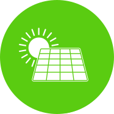

# 
<figure>
  
</figure>

## Ingenieria.
Estudios de Eficiencia Energética y Autoconsumo

```
=== "C"

    ``` c
    #include <stdio.h>

    int main(void) {
      printf("Hello world!\n");
      return 0;
    }
    ```

=== "C++"

    ``` c++
    #include <iostream>

    int main(void) {
      std::cout << "Hello world!" << std::endl;
      return 0;
    }
    ```
```

!!! info "[**Mecanismo de compensación de excedentes**](Anexo_IV_Ejemplos.md){ .md-button }"
!!! info  "[**La Factura de la luz**](Factura_Luz.md){ .md-button }"
!!! info  "[**Instalacion FV**](./RENOVABLES/Instalacion_FV.md){ .md-button }"
!!! info  "[**Viabilidad Economica**](Viabilidad_Economica.md){ .md-button }"
!!! Question  "[**Funcionamiento de la App**](app.md){ .md-button }"

