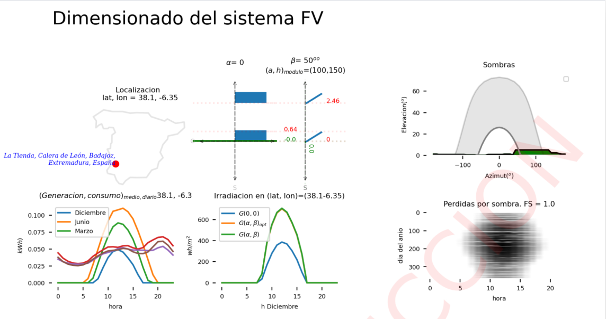
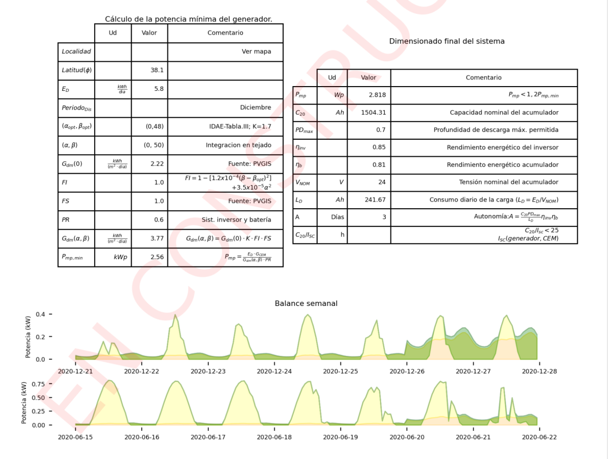

#

=== "{ width="15" } Renovables "
    === "Fotovoltaica "
        { width="300" }

        
        
    === "Eolica "
        !!! info  "[{ width="40" } EOLICA](./RENOVABLES/Instalacion_EOLICA.md){ .md-button }"

=== "{ width="15" } Auditoria"

    !!! info "[Compensación de excedentes](./AUDITORIA/Anexo_IV_Ejemplos.md){ .md-button }"
    !!! info  "[La Factura de la luz](./AUDITORIA/Factura_Luz.md){ .md-button }"

    !!! info  "[Viabilidad Economica](./AUDITORIA/Viabilidad_Economica.md){ .md-button }"

    !!! Question  "[Ayuda](app.md){ .md-button }"

=== "{ width="15" } Ayudas "

