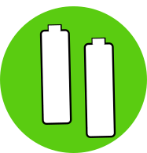

---
url:

  direccion1: http://192.168.1.113:8080/f1
---

{ width="545" }

=== "{ width="15" }FV "
    === "Resumen "
        
        
    === "Instalacion "

=== "Auditoria "
    !!! info  "[{ width="40" } EOLICA](./RENOVABLES/Instalacion_EOLICA.md){ .md-button }"
=== "{ width="15" } Personaliza "
    hola caracola
    
<iframe id="frame" src="{{ fig.url }}"></iframe>
fsdfasfdasd

    !!! info "[Compensación de excedentes](./AUDITORIA/Anexo_IV_Ejemplos.md){ .md-button }"
    !!! info  "[La Factura de la luz](./AUDITORIA/Factura_Luz.md){ .md-button }"

    !!! info  "[Viabilidad Economica](./AUDITORIA/Viabilidad_Economica.md){ .md-button }"

    !!! Question  "[Ayuda](app.md){ .md-button }"

